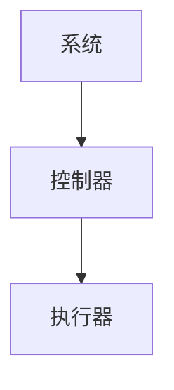
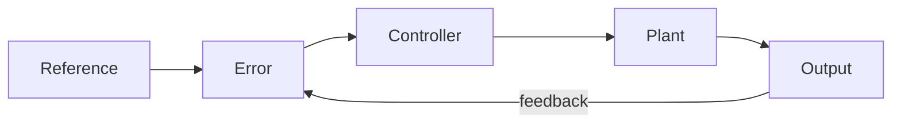

系统矩阵为：

$$
A = \begin{bmatrix}
0 & 1 \\
-2 & -3
\end{bmatrix}
$$

对应 Python 验证代码：

```python
import numpy as np
A = np.array([[0,1],[-2,-3]])
```



| Name | Value |
|------|-------|
| Kp   | 1.2   |
| Ki   | 0.8   |

$\int _{0}^{1} \sin(x) \mathrm{d}x$

$$\int _{0}^{1} \sin(x) \mathrm{d}x$$

<iframe width="600" height="400"
src="https://www.youtube.com/embed/_bqa_I5hNAo"
frameborder="0" allowfullscreen></iframe>

